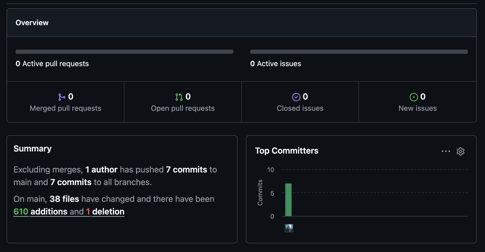

# Update Sprint #1

**Name:** Leonard Breuer 
**Klasse:** 2BHITM 
**Projekt:** Minemasters 

## Änderungen

- Seiten wechseln funktioniert
- Loading Screen
- Gute Tutorial Seite und Startseite
- Pc angefangen
- Inventory Layout

## Ziele bis zum nächsten Sprint:

- Bug mit backbutton fixen
- Inventory + Shop Struktur
- PcSreen und Inventory Ordentlich designen
- Spieldaten in json vorhanden
- Kernmechanik soll Funktionieren